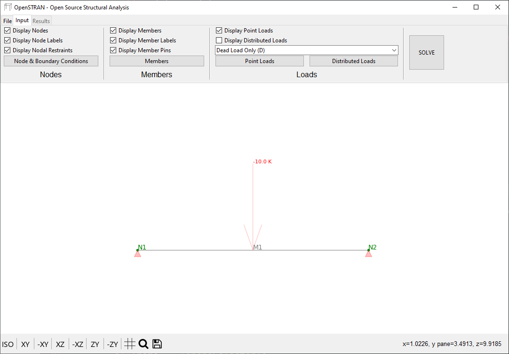
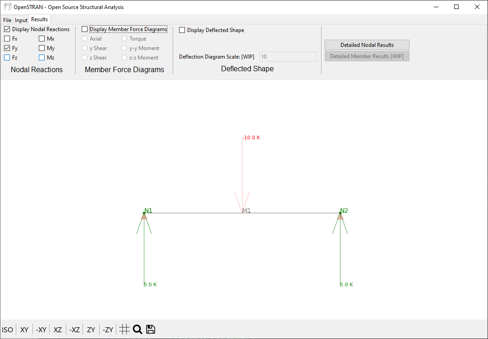
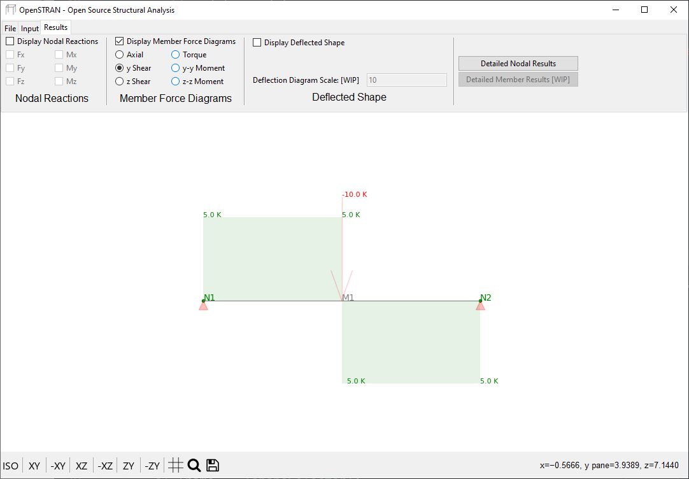
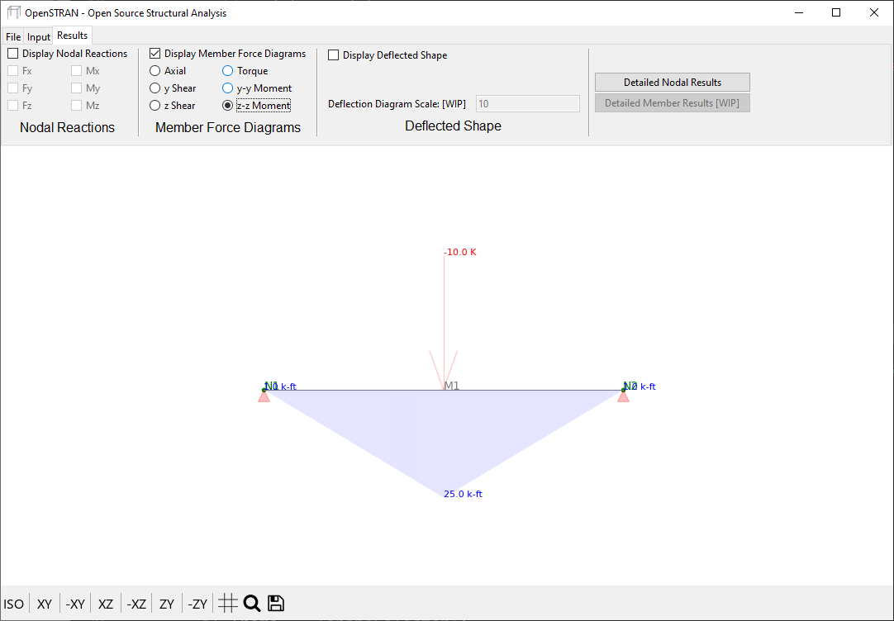
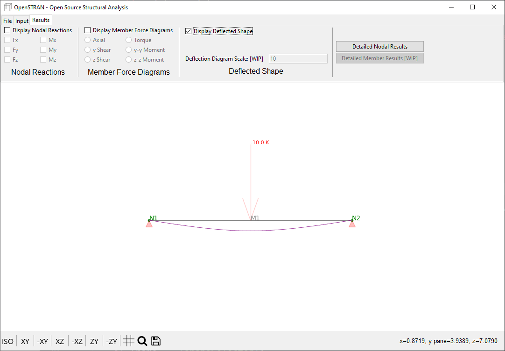

# OpenSTRAN

Open-Source Structural Analysis with Python

* Version 0.0.4 - Alpha Release

## Installation
```
$ pip install OpenSTRAN
```

## Dependencies

OpenSTRAN depends on the following packages:
* matplotlib - used for input/output visualization.
* numpy - used for vector and matrix mathematical operations.

It is recommended to install these dependencies which may be done using the following command.
```
$ pip install matplotlib
```

## Capabilities

OpenStruct allows for the creation of simple two-dimensional frame elements and complex three-dimensional structures alike.

* 2D truss :heavy_check_mark:
* 3D truss :heavy_check_mark:
* 2D frame :heavy_check_mark:
* 3D space frame :heavy_check_mark:
* Graphical User Interface :heavy_check_mark:

## Limitations
* First order elastic analysis only.
* Shear and torsional deformations are not considered.
* Does not take advantage of matrix sparseness or bandedness.
* Supports Imperial units only.

Second order analysis methods, solution time optimization, support for metric units and much more is currently under development. OpenSTRAN is in the early stages of development and is continuously being improved.

## Get Involved

If you would like to contribute to the development of OpenSTRAN, you are encouraged to get involved. Below are some simple ways that you can begin contributing. Keep in mind that this is not an exhaustive list and that contributions can be as simple as reporting an error if you find one, sharing your experience with the library or suggesting the addition of a feature you would like to see.

* Help potential users learn OpenSTRAN by creating examples.
* Create documentation for portions of the code base.
* Validate output by comparing results with known solutions.
* Develop features by issuing a pull request.
* Increase readability of source code through refactoring and commenting.

All contributions are welcome and done on a voluntary basis.

## Quickstart Example

Below is a simple example that will help you get started using OpenSTRAN. The example consists of a simply supported beam subject to a point load.


```python
from OpenSTRAN.model import Model

# instantiate an empty model
simpleBeam = Model()

# create a node located at the origin
N1 = simpleBeam.nodes.addNode(0,0,0,'N1') # (X [ft], Y [ft], Z[ft], name)

# create a node 10 feet away from the origin along the global X axis.
N2 = simpleBeam.nodes.addNode(10,0,0,'N2') # (X [ft], Y [ft], Z[ft], name)

# restrain the nodes from translation.
N1.restraint = [1,1,1,0,0,0] # [Ux, Uy, Uz, φx, φy, φz] -> pinned node
N2.restraint = [1,1,1,0,0,0] # [Ux, Uy, Uz, φx, φy, φz] -> pinned node

# define a member between nodes N1 and N2.
M1 = simpleBeam.members.addMember(N1, N2) # (i node, j node)

# add a dead load of -10 kips in the global Y direction 50% along M1's span.
simpleBeam.loads.addPointLoad(M1, direction='Y', D=-10, location=50)

# display the model within an interactive graphical user interface.
simpleBeam.plot()
```




